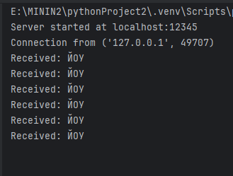
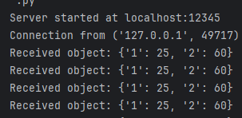
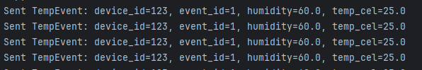

### Задание

TCP Client-streaming (Клиент, например, раз в 1 секунду отправляет данные на сервер), используя встроенный в Python модуль socket.

Task_3_1_server.py Task_3_1_client.py Используя encode() и decode()

Task_3_2_server.py Task_3_2_client.py Используя pickle - де/сериализация произвольных объектов.

Task_3_3_server.py Task_3_3_client.py Используя Google Protocol Buffers - де/сериализация определенных структурированных данных, а не произвольных объектов Python

### Листинг
##### task3.proto
```
syntax = "proto3";
package pb;

message TempEvent {
    int32 device_id = 1;
    int32 event_id = 2;
    float humidity = 3;
    float temp_cel = 4;
    bytes video_data = 5;
}
```
##### Task_3_1_server.py
```python
import socket  # Импортируем модуль socket для работы с сетевыми соединениями


def start_server(host='localhost', port=12345):
    server_socket = socket.socket(socket.AF_INET,
                                  socket.SOCK_STREAM)   
    server_socket.bind((host, port))  # Привязываем сокет к хосту и порту
    server_socket.listen(1)  # Начинаем прослушивание входящих соединений, максимум 1 клиент в очереди
    print(f"Server started at {host}:{port}")

    conn, addr = server_socket.accept()  # Принимаем входящее соединение
    print(f"Connection from {addr}")

    while True:
        data = conn.recv(1024).decode('utf-8')  # Получаем данные от клиента и декодируем их из байтов в строку
        if not data:  # Если данные отсутствуют, выходим из цикла
            break
        print(f"Received: {data}")  # Выводим полученные данные

    conn.close()  # Закрываем соединение
    print("Connection closed")


if __name__ == "__main__":
    start_server()  # Запускаем сервер
```


##### Task_3_1_client.py
```python
import socket  # Импортируем модуль socket для работы с сетевыми соединениями
import time  # Импортируем модуль time для работы с задержками


def start_client(host='localhost', port=12345):
    client_socket = socket.socket(socket.AF_INET,
                                  socket.SOCK_STREAM)   
    client_socket.connect((host, port))  # Подключаемся к серверу

    try:
        while True:
            data = "ЙОУ"  # Отправляемая строка данных
            client_socket.send(data.encode('utf-8'))  # Кодируем строку в байты и отправляем на сервер
            time.sleep(1)  # Задержка в 1 секунду
    except KeyboardInterrupt:
        print("Client stopped.")  # Обработка остановки клиента при нажатии Ctrl+C
    finally:
        client_socket.close()  # Закрываем соединение


if __name__ == "__main__":
    start_client()  # Запускаем клиента

```

##### Task_3_2_client.py
```python
import socket  # Импортируем модуль socket для работы с сетевыми соединениями
import pickle  # Импортируем модуль pickle для сериализации объектов
import time  # Импортируем модуль time для работы с задержками


def start_client(host='localhost', port=12345):
    client_socket = socket.socket(socket.AF_INET,
                                  socket.SOCK_STREAM)   
    client_socket.connect((host, port))  # Подключаемся к серверу

    try:
        while True:
            data = {"1": 25, "2": 60}  # Создаем объект с данными для отправки
            serialized_data = pickle.dumps(data)  # Сериализуем объект в байты
            client_socket.send(serialized_data)  # Отправляем сериализованные данные на сервер

            time.sleep(1)  # Задержка в 1 секунду
    except KeyboardInterrupt:
        print("Client stopped.")  # Обработка остановки клиента при нажатии Ctrl+C
    finally:
        client_socket.close()  # Закрываем соединение


if __name__ == "__main__":
    start_client()  # Запускаем клиента
```

##### Task_3_2_server.py
```python
import socket  # Импортируем модуль socket для работы с сетевыми соединениями
import pickle  # Импортируем модуль pickle для сериализации и десериализации объектов


def start_server(host='localhost', port=12345):
    server_socket = socket.socket(socket.AF_INET,
                                  socket.SOCK_STREAM)   
    server_socket.bind((host, port))  # Привязываем сокет к хосту и порту
    server_socket.listen(1)  # Начинаем прослушивание входящих соединений, максимум 1 клиент в очереди
    print(f"Server started at {host}:{port}")

    conn, addr = server_socket.accept()  # Принимаем входящее соединение
    print(f"Connection from {addr}")

    while True:
        data = conn.recv(4096)  # Получаем данные от клиента
        if not data:  # Если данные отсутствуют, выходим из цикла
            break
        obj = pickle.loads(data)  # Десериализуем объект из байтов
        print(f"Received object: {obj}")  # Выводим полученный объект

    conn.close()  # Закрываем соединение
    print("Connection closed")


if __name__ == "__main__":
    start_server()  # Запускаем сервер
```


##### Task_3_3_client.py
```python
import socket  # Импортируем модуль socket для работы с сетевыми соединениями
import task3_pb2  # Импортируем сгенерированный файл Protocol Buffers
import time  # Импортируем модуль time для работы с задержками


def start_client(host='localhost', port=12345):
    client_socket = socket.socket(socket.AF_INET,
                                  socket.SOCK_STREAM)   
    client_socket.connect((host, port))  # Подключаемся к серверу

    try:
        while True:
            temp_event = task3_pb2.TempEvent()  # Создаем экземпляр сообщения TempEvent
            temp_event.device_id = 123  # Устанавливаем значение device_id
            temp_event.event_id = 1  # Устанавливаем значение event_id
            temp_event.humidity = 60.0  # Устанавливаем значение humidity
            temp_event.temp_cel = 25.0  # Устанавливаем значение temp_cel
            serialized_data = temp_event.SerializeToString()  # Сериализуем объект в строку байтов
            client_socket.send(serialized_data)  # Отправляем сериализованные данные на сервер
            print(
                f"Sent TempEvent: device_id={temp_event.device_id}, event_id={temp_event.event_id}, humidity={temp_event.humidity}, temp_cel={temp_event.temp_cel}")  # Выводим отправленные данные
            time.sleep(1)  # Задержка в 1 секунду
    except KeyboardInterrupt:
        print("Client stopped.")  # Обработка остановки клиента при нажатии Ctrl+C
    finally:
        client_socket.close()  # Закрываем соединение


if __name__ == "__main__":
    start_client()  # Запускаем клиента

```

##### Task_3_3_server.py
```python
import socket  # Импортируем модуль socket для работы с сетевыми соединениями
import task3_pb2  # Импортируем сгенерированный файл Protocol Buffers


def start_server(host='localhost', port=12345):
    server_socket = socket.socket(socket.AF_INET,
                                  socket.SOCK_STREAM)  
    server_socket.bind((host, port))  # Привязываем сокет к хосту и порту
    server_socket.listen(1)  # Начинаем прослушивание входящих соединений, максимум 1 клиент в очереди
    print(f"Server started at {host}:{port}")

    conn, addr = server_socket.accept()  # Принимаем входящее соединение
    print(f"Connection from {addr}")

    while True:
        data = conn.recv(4096)  # Получаем данные от клиента
        if not data:  # Если данные отсутствуют, выходим из цикла
            break
        temp_event = task3_pb2.TempEvent()  # Создаем экземпляр сообщения TempEvent
        temp_event.ParseFromString(data)  # Парсим данные из байтового представления
        print(
            f"Received TempEvent: device_id={temp_event.device_id}, event_id={temp_event.event_id}, humidity={temp_event.humidity}, temp_cel={temp_event.temp_cel}")  # Выводим данные сообщения

    conn.close()  # Закрываем соединение
    print("Connection closed")


if __name__ == "__main__":
    start_server()  # Запускаем сервер

```

### Результат работы программы

##### Task_3_1_server.py


##### Task_3_2_server.py


##### Task_3_3_server.py




### Пояснение

Task 3.1 (Использование encode/decode)

Server (Task_3_1_server.py):

Скрипт создает сервер, который использует сокеты для связи с клиентом. Сначала он создает сокет, привязывает его к заданному хосту и порту, а затем начинает слушать входящие подключения. После установления соединения сервер принимает данные от клиента в байтовом формате и декодирует их в строку для дальнейшего вывода. Процесс продолжается до тех пор, пока клиент не прекратит отправку данных, после чего соединение закрывается.

Client (Task_3_1_client.py):

Скрипт создает клиент, который подключается к серверу и отправляет строку "ЙОУ" каждые секунду. Данные предварительно кодируются в байты перед отправкой. Клиент работает в бесконечном цикле, пока его не прервут (например, с помощью Ctrl+C). По завершении соединение с сервером закрывается.

Task 3.2 (Использование pickle для сериализации)
Server (Task_3_2_server.py):

Этот сервер работает аналогично предыдущему, но в этом случае сервер принимает не строки, а сериализованные с помощью pickle объекты. После получения данных сервер десериализует их в исходный объект и выводит его содержимое. Такой подход позволяет передавать сложные структуры данных, такие как словари.

Client (Task_3_2_client.py):

Клиент подключается к серверу и каждые секунду отправляет сериализованный словарь. Сначала данные сериализуются с помощью pickle, затем отправляются на сервер в байтовом формате. Это позволяет передавать более сложные типы данных, чем просто строки.

Task 3.3 (Использование Protocol Buffers)
Server (Task_3_3_server.py):

Этот сервер принимает данные, которые были сериализованы с использованием Protocol Buffers. Он создает экземпляр сообщения TempEvent, используя сгенерированный код task3_pb2, и затем парсит данные из байтового представления. Это обеспечивает строгую типизацию и компактное представление данных, что делает передачу информации более эффективной и надежной.

Client (Task_3_3_client.py):

Клиент создает сообщение TempEvent, заполняет его поля (например, device_id, event_id, humidity, temp_cel) и сериализует его в байты для отправки на сервер. Использование Protocol Buffers обеспечивает передачу структурированных данных, что делает этот подход предпочтительным для сложных систем, где требуется четкое определение формата данных и их валидация.