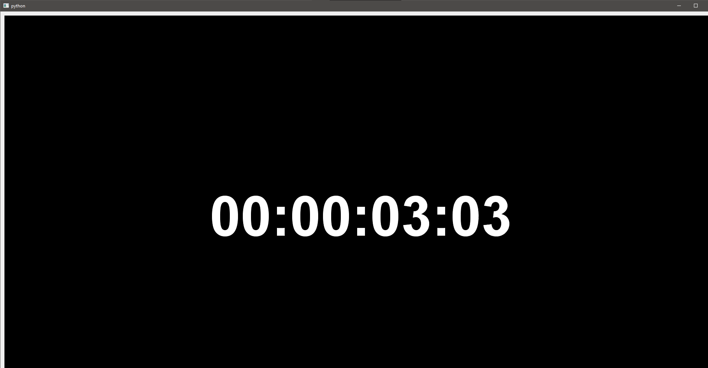

## Задание
Клиент отправляет видео на PySide6 сервер, где происходит отображение этого видео в виджете.

## Листинг

```proto
syntax = "proto3";

package video;

message VideoFrame {
    bytes frame_data = 1;
}
```
##### Сервер[py_side_server.py](py_side_server.py)
```python
from PySide6.QtWidgets import QApplication, QLabel, QGridLayout, \
    QWidget  # Импортируются необходимые виджеты из библиотеки PySide6 для создания графического интерфейса
from PySide6.QtNetwork import QTcpServer, QTcpSocket, \
    QHostAddress  # Импортируются классы для работы с сетевыми соединениями, такие как TCP сервер и сокеты
from PySide6.QtCore import QByteArray, Signal, \
    QObject  # Импортируются необходимые классы для работы с сигналами и буфером данных
from PySide6.QtGui import QImage, QPixmap  # Импортируются классы для работы с изображениями и отображением их в виджете
import sys
import video_frame_pb2  # Импорт сгенерированного модуля Protobuf, содержащего классы для работы с сообщениями Protobuf

app = QApplication(sys.argv)
window = QWidget()  # Создание главного окна

buffer = QByteArray()  # Буфер для хранения входящих данных

# Создание виджета для отображения изображения
up_camera = QLabel()
grid = QGridLayout(window)
grid.addWidget(up_camera, 0, 0)

# Настройка и запуск TCP сервера
tcpServer = QTcpServer()  # Создание TCP сервера для прослушивания входящих соединений
tcpServer.listen(QHostAddress.LocalHost,
                 12345)  # Настройка TCP сервера на прослушивание соединений по адресу localhost и порту 12345


# Сигнал для обновления изображения
class ImageUpdater(QObject):
    up_camera_signal = Signal(QImage)

    def __init__(self):
        super().__init__()
        self.up_camera_signal.connect(self.update_frame)

    def update_frame(self, image):
        up_camera.setPixmap(QPixmap.fromImage(image))


image_updater = ImageUpdater()


def handle_new_connection():
    """Метод, вызываемый при новом соединении"""
    client_socket = tcpServer.nextPendingConnection()  # Получение следующего ожидающего соединения клиента
    client_socket.readyRead.connect(lambda: process_video_data(client_socket))


def process_video_data(socket: QTcpSocket):
    """Метод для чтения и обработки видеоданных"""
    global buffer
    buffer.append(socket.readAll())  # Добавление всех данных, считанных из сокета, в буфер для последующей обработки
    video_frame = video_frame_pb2.VideoFrame()
    if video_frame.ParseFromString(
            buffer.data()):  # Попытка десериализовать данные из буфера с использованием Protobuf. Если успешно, данные кадра будут извлечены
        image = QImage()
        image.loadFromData(video_frame.frame_data, "JPEG")
        if not image.isNull():
            image_updater.up_camera_signal.emit(image)
        buffer.clear()


# Подключение обработчика для новых соединений
tcpServer.newConnection.connect(handle_new_connection)

# Запуск приложения
window.show()
sys.exit(app.exec_())

```
##### Клиент[py_side_client.py](py_side_client.py)
```python
import cv2
import socket
import video_frame_pb2  # Импорт сгенерированного модуля Protobuf, содержащего классы для работы с сообщениями Protobuf

def send_video_frame_by_frame(video_path, server_ip, server_port):
    cap = cv2.VideoCapture(video_path)  # Открытие видеофайла для захвата кадров с помощью OpenCV
    with socket.socket(socket.AF_INET, socket.SOCK_STREAM) as sock:
        sock.connect((server_ip, server_port))  # Установка соединения с сервером по заданному IP-адресу и порту
        while cap.isOpened():
            ret, frame = cap.read()
            # Если кадр есть
            if not ret:
                break
            # Кодирование кадра в формате JPEG
            _, buffer = cv2.imencode('.jpg', frame)  # Кодирование кадра в формат JPEG и сохранение его в буфер
            # Создание сообщения VideoFrame
            video_frame = video_frame_pb2.VideoFrame()
            video_frame.frame_data = buffer.tobytes()  # Запись закодированных данных кадра в сообщение Protobuf
            # Сериализация сообщения и его отправка
            sock.sendall(video_frame.SerializeToString())  # Сериализация сообщения Protobuf и его отправка на сервер
    # Освобождение ресурсов захвата видео
    cap.release()

if __name__ == "__main__":
    video_path = '1.mp4'
    send_video_frame_by_frame(video_path, '127.0.0.1', 12345)
```

## Результат работы программы



### Пояснение
## Server
Создание окна и буфера:

Создается главное окно (window) и буфер (buffer), который будет использоваться для хранения входящих данных.

Создание виджета для отображения изображения:

Виджет QLabel используется для отображения изображения. Он добавляется в компоновку QGridLayout.

Настройка TCP-сервера:

Создается QTcpServer, который прослушивает соединения на localhost и порту 12345.

Сигнал для обновления изображения:

Создается класс ImageUpdater, который содержит сигнал up_camera_signal. Этот сигнал используется для обновления изображения в виджете QLabel.

Обработчик нового подключения:

handle_new_connection вызывается при новом соединении с сервером, создает объект сокета и подключает обработчик чтения данных.

Чтение и обработка видеоданных:

В process_video_data данные, полученные из сокета, добавляются в буфер. После этого они десериализуются с использованием Protobuf, и если данные кадра валидны, они преобразуются в изображение и отображаются на виджете.

## Client
Функция send_video_frame_by_frame открывает видеофайл с помощью OpenCV и устанавливает соединение с сервером.

Кадры видео считываются в цикле. Каждый кадр кодируется в формат JPEG, затем сериализуется с использованием Protobuf и отправляется на сервер.

После завершения передачи видео файл освобождается (cap.release()).