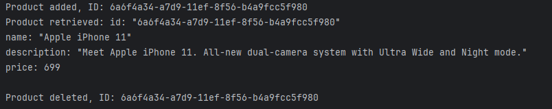

## Задание
Глава 1,2
Разобрать пример Python с GitHub.

## Листинги
### proto
```proto
syntax = "proto3";

package ecommerce;

// Импорт встроенного сообщения для пустого ответа.
import "google/protobuf/empty.proto";

// Описание gRPC-сервиса ProductInfo.
service ProductInfo {
    // Метод для добавления продукта, возвращает его ID.
    rpc addProduct(Product) returns (ProductID);
    // Метод для получения информации о продукте по его ID.
    rpc getProduct(ProductID) returns (Product);
    // Метод для удаления продукта по его ID.
    rpc deleteProduct(ProductID) returns (google.protobuf.Empty);
}

// Описание сообщения о продукте.
message Product {
    string id = 1; // Уникальный идентификатор продукта.
    string name = 2; // Название продукта.
    string description = 3; // Описание продукта.
    float price = 4; // Цена продукта.
}

// Сообщение для передачи ID продукта.
message ProductID {
    string value = 1; // Значение ID.
}
```
### Сервер
```python
from concurrent import futures
import grpc
import product_info_pb2
import product_info_pb2_grpc
import uuid
import google.protobuf.empty_pb2

# Реализация сервиса ProductInfo.
class ProductInfoServicer(product_info_pb2_grpc.ProductInfoServicer):
    """Сервис для управления информацией о продуктах."""

    def __init__(self):
        # Локальное хранилище данных о продуктах (ключ - ID продукта).
        self.productMap = {}

    def addProduct(self, request, context):
        """Добавление нового продукта."""
        # Генерируется уникальный ID для нового продукта.
        id = str(uuid.uuid1())
        # Продукт сохраняется в словаре, ID присваивается объекту.
        self.productMap[id] = request
        self.productMap[id].id = id
        # Возвращается объект с уникальным ID.
        return product_info_pb2.ProductID(value=id)

    def getProduct(self, request, context):
        """Получение информации о продукте по его ID."""
        # Ищем продукт по ID.
        product = self.productMap.get(request.value)
        if product:
            # Если найден, возвращаем.
            return product
        else:
            # Если нет, устанавливается ошибка NOT_FOUND.
            context.set_code(grpc.StatusCode.NOT_FOUND)
            context.set_details('Product not found')

    def deleteProduct(self, request, context):
        """Удаление продукта по его ID."""
        if request.value in self.productMap:
            # Если продукт существует, удаляем.
            del self.productMap[request.value]
            # Возвращаем пустой ответ.
            return google.protobuf.empty_pb2.Empty()
        else:
            # Устанавливается ошибка NOT_FOUND.
            context.set_code(grpc.StatusCode.NOT_FOUND)
            context.set_details('Product not found')
            return google.protobuf.empty_pb2.Empty()

# Создание и настройка gRPC-сервера.
server = grpc.server(futures.ThreadPoolExecutor(max_workers=10))
# Регистрация сервиса на сервере.
product_info_pb2_grpc.add_ProductInfoServicer_to_server(
    ProductInfoServicer(), server)
# Сервер слушает порт 50051.
server.add_insecure_port('[::]:50051')
# Запуск сервера.
server.start()
server.wait_for_termination()
```
### Клиент
```python
import grpc
import product_info_pb2
import product_info_pb2_grpc

def run():
    # Установка связи с сервером через insecure канал.
    with grpc.insecure_channel('localhost:50051') as channel:
        # Создаем клиентский объект-заместитель (stub).
        stub = product_info_pb2_grpc.ProductInfoStub(channel)

        # Отправляем запрос на добавление нового продукта.
        added_product = stub.addProduct(product_info_pb2.Product(
            name="Apple iPhone 11", 
            description="Meet Apple iPhone 11. All-new dual-camera system with Ultra Wide and Night mode.", 
            price=699.0
        ))
        print("Product added, ID:", added_product.value)

        # Получаем информацию о продукте по ID.
        product_info = stub.getProduct(product_info_pb2.ProductID(value=added_product.value))
        print("Product retrieved:", product_info)

        # Удаляем продукт по ID.
        stub.deleteProduct(product_info_pb2.ProductID(value=added_product.value))
        print("Product deleted, ID:", added_product.value)

if __name__ == '__main__':
    run()
```
## Результат работы программы


## Пояснение
package ecommerce;

Устанавливает пространство имен для сервисов и сообщений. Это полезно, если в одном проекте несколько .proto файлов.

Импорт google/protobuf/empty.proto:

Подключается встроенное сообщение Empty, которое используется для методов, не требующих сложного ответа, например, deleteProduct.

Сервис ProductInfo:

Определяет интерфейс взаимодействия клиента с сервером через три метода:

addProduct принимает объект Product и возвращает уникальный идентификатор (ProductID).

getProduct принимает ProductID и возвращает объект Product.

deleteProduct принимает ProductID и возвращает Empty в случае успеха.

Сообщение Product:

Описывает структуру данных для продукта:

id — уникальный идентификатор (например, UUID).

name, description, price — ключевые свойства продукта.

Сообщение ProductID:

Простая структура для передачи уникального идентификатора продукта.

Класс ProductInfoServicer:

Реализация методов, определенных в proto-файле:

__init__:

Используется словарь productMap для хранения продуктов. Это временное хранилище, имитирующее базу данных.

addProduct:

Создает новый продукт, присваивает ему уникальный ID и сохраняет в productMap.

getProduct:

Проверяет наличие продукта в словаре по ID и возвращает его. Если продукт не найден, устанавливается ошибка NOT_FOUND.

deleteProduct:

Удаляет продукт по ID. Если продукт не найден, устанавливается ошибка NOT_FOUND.

Настройка сервера:

Используется многопоточный сервер, поддерживающий до 10 потоков одновременно.

Регистрируется сервис ProductInfoServicer.

Сервер запускается на порту 50051 и ожидает запросов.

Настройка клиента:

Устанавливается канал связи с сервером (localhost:50051) через grpc.insecure_channel.

ProductInfoStub — объект, который реализует вызовы методов сервиса от лица клиента.

Работа с сервисом:

addProduct:

Клиент отправляет запрос на добавление нового продукта с указанием имени, описания и цены. Сервер возвращает уникальный ID продукта.

getProduct:

Клиент запрашивает информацию о продукте по ID, полученному ранее. Если продукт существует, он возвращается.

deleteProduct:

Клиент отправляет запрос на удаление продукта по ID. Если продукт успешно удален, возвращается пустой ответ.

Важные моменты:

Канал закрывается автоматически при выходе из контекста (with).

Клиент напрямую работает с сервисом, не заботясь о внутренней реализации.