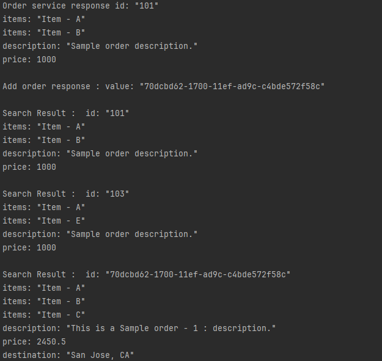
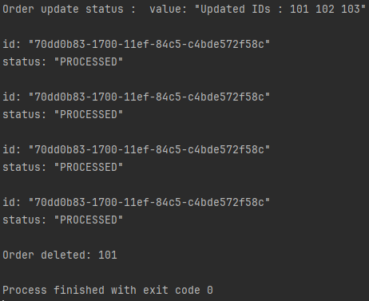

## Задание
Разобрать пример Python с GitHub.

## Листинги

### proto
```proto
syntax = "proto3"; 

import "google/protobuf/wrappers.proto"; // Импорт стандартной библиотеки для работы с обертками (например, StringValue).
import "google/protobuf/empty.proto"; // Импорт стандартной библиотеки для работы с пустыми значениями.

package ecommerce; // Указывает пространство имен, к которому относится данный сервис.

service OrderManagement { // Определение gRPC-сервиса с именем OrderManagement.
    rpc addOrder(Order) returns (google.protobuf.StringValue); 
    // RPC-метод для добавления нового заказа. Принимает объект типа Order и возвращает строковое значение (ID заказа).

    rpc getOrder(google.protobuf.StringValue) returns (Order);
    // RPC-метод для получения заказа по ID. Принимает строку (ID заказа) и возвращает объект Order.

    rpc searchOrders(google.protobuf.StringValue) returns (stream Order);
    // RPC-метод для поиска заказов по заданному критерию. Принимает строку (запрос) и возвращает поток объектов Order.

    rpc updateOrders(stream Order) returns (google.protobuf.StringValue);
    // RPC-метод для обновления заказов. Принимает поток объектов Order и возвращает строку с результатом обновления.

    rpc processOrders(stream google.protobuf.StringValue) returns (stream CombinedShipment);
    // RPC-метод для обработки заказов. Принимает поток строк (ID заказов) и возвращает поток объектов CombinedShipment.

    rpc deleteOrder(google.protobuf.StringValue) returns (google.protobuf.Empty);
    // RPC-метод для удаления заказа. Принимает строку (ID заказа) и возвращает пустое значение, указывающее на успех операции.
}

message Order { // Определение сообщения, представляющего заказ.
    string id = 1; // Поле для уникального идентификатора заказа.
    repeated string items = 2; // Поле для списка товаров в заказе (массив строк).
    string description = 3; // Поле для описания заказа.
    float price = 4; // Поле для цены заказа.
    string destination = 5; // Поле для места назначения заказа.
}

message CombinedShipment { // Определение сообщения, представляющего объединенную доставку.
    string id = 1; // Поле для уникального идентификатора доставки.
    string status = 2; // Поле для текущего статуса доставки.
    repeated Order ordersList = 3; // Поле для списка заказов, входящих в доставку.
}

```
### Сервер
```python
from concurrent import futures  # Для управления потоками.
import time  # Для работы со временем (например, задержки).
from typing import OrderedDict  # Для упорядоченного словаря.
import uuid  # Для генерации уникальных идентификаторов.
from google.protobuf import wrappers_pb2  # Типы-обертки, например, StringValue.
import google.protobuf  # Основной модуль Protocol Buffers.
import grpc  # gRPC библиотека.
import order_management_pb2_grpc  # Сгенерированный код gRPC для сервиса.
import order_management_pb2  # Сгенерированный код Protocol Buffers для сообщений.

class OrderManagementServicer(order_management_pb2_grpc.OrderManagementServicer):
    # Реализация методов, определенных в proto-файле.

    def __init__(self):
        # Конструктор, где инициализируется словарь для хранения заказов.
        self.orderDict = {}  # Словарь для хранения заказов (ключ: ID заказа, значение: объект Order).

        # Добавление нескольких тестовых заказов в словарь.
        self.orderDict['101'] = order_management_pb2.Order(
            id='101', price=1000, items=['Item - A', 'Item - B'], description='Sample order description.')
        self.orderDict['102'] = order_management_pb2.Order(
            id='102', price=1000, items=['Item - C'], description='Sample order description.')
        self.orderDict['103'] = order_management_pb2.Order(
            id='103', price=1000, items=['Item - A', 'Item - E'], description='Sample order description.')
        self.orderDict['104'] = order_management_pb2.Order(
            id='104', price=1000, items=['Item - F', 'Item - G'], description='Sample order description.')

    def getOrder(self, request, context):
        # Метод для получения заказа по ID.
        order = self.orderDict.get(request.value)  # Получение заказа по ID из словаря.
        if order is not None:
            return order  # Возвращаем заказ, если он найден.
        else:
            # Если заказ не найден, устанавливаем статус ошибки.
            context.set_code(grpc.StatusCode.NOT_FOUND)
            context.set_details(f'Order: {request.value} Not Found.')
            return order_management_pb2.Order()  # Возвращаем пустой объект Order.

    def addOrder(self, request, context):
        # Метод для добавления нового заказа.
        id = uuid.uuid1()  # Генерация уникального ID.
        request.id = str(id)  # Устанавливаем сгенерированный ID для заказа.
        self.orderDict[request.id] = request  # Добавляем заказ в словарь.
        response = wrappers_pb2.StringValue(value=str(id))  # Возвращаем ID нового заказа.
        return response

    def searchOrders(self, request, context):
        # Метод для поиска заказов по строке запроса.
        matching_orders = self.searchInventory(request.value)  # Поиск заказов по критерию.
        for order in matching_orders:
            yield order  # Возвращаем поток заказов.

    def updateOrders(self, request_iterator, context):
        # Метод для обновления информации о заказах.
        response = 'Updated IDs :'  # Начальная строка ответа.
        for order in request_iterator:  # Обрабатываем поток входящих заказов.
            self.orderDict[order.id] = order  # Обновляем заказ в словаре.
            response += ' ' + order.id  # Добавляем ID обновленного заказа в ответ.
        return wrappers_pb2.StringValue(value=response)  # Возвращаем результат обновления.

    def processOrders(self, request_iterator, context):
        # Метод для обработки заказов и создания доставки.
        shipment_id = uuid.uuid1()  # Генерация ID доставки.
        shipments = []  # Список доставок.

        shipment = order_management_pb2.CombinedShipment(id=str(shipment_id), status='PROCESSED')
        # Создаем новый объект доставки с заданным ID и статусом.

        shipments.append(shipment)  # Добавляем объект доставки в список.
        for order_id in request_iterator:  # Обрабатываем поток входящих ID заказов.
            for order in shipments:  # Итерируемся по заказам в доставке.
                yield order  # Возвращаем поток обработанных заказов.

    def searchInventory(self, query):
        # Метод для поиска заказов по критерию (используется в searchOrders).
        matchingOrders = []  # Список подходящих заказов.
        for order_id, order in self.orderDict.items():  # Перебор всех заказов в словаре.
            for itm in order.items:  # Перебор всех элементов в заказе.
                if query in itm:  # Если элемент соответствует запросу.
                    matchingOrders.append(order)  # Добавляем заказ в список результатов.
                    break
        return matchingOrders

    def deleteOrder(self, request, context):
        # Метод для удаления заказа по ID.
        if request.value in self.orderDict:  # Проверяем, существует ли заказ.
            del self.orderDict[request.value]  # Удаляем заказ из словаря.
            return google.protobuf.empty_pb2.Empty()  # Возвращаем пустой объект в случае успеха.
        else:
            # Если заказ не найден, устанавливаем статус ошибки.
            context.set_code(grpc.StatusCode.NOT_FOUND)
            context.set_details(f'Order with ID {request.value} not found')
            return google.protobuf.empty_pb2.Empty()

# Настройка сервера.
server = grpc.server(futures.ThreadPoolExecutor(max_workers=10))  # Создаем сервер с пулом из 10 потоков.
order_management_pb2_grpc.add_OrderManagementServicer_to_server(OrderManagementServicer(), server)
# Регистрируем реализацию сервиса в сервере.

print('Starting server. Listening on port 50051.')  # Сообщение о запуске сервера.
server.add_insecure_port('[::]:50051')  # Настройка порта для приема соединений.
server.start()  # Запуск сервера.
server.wait_for_termination()  # Ожидание завершения работы сервера.

```
### Клиент
```python
from google.protobuf import wrappers_pb2  # Импорт типов-оберток, например, StringValue.
import grpc  # Библиотека для работы с gRPC.
import order_management_pb2  # Сгенерированный код Protocol Buffers для сообщений.
import order_management_pb2_grpc  # Сгенерированный код gRPC для сервиса.

def run():
    # Установка соединения с сервером gRPC.
    channel = grpc.insecure_channel('localhost:50051')  # Создаем канал для связи с сервером по адресу localhost и порту 50051.

    # Создание клиентского stub (объекта для вызова методов сервера).
    stub = order_management_pb2_grpc.OrderManagementStub(channel)

    # Создание нового объекта заказа для добавления на сервер.
    order1 = order_management_pb2.Order(
        items=['Item - A', 'Item - B', 'Item - C'],  # Список предметов в заказе.
        price=2450.50,  # Цена заказа.
        description='This is a Sample order - 1 : description.',  # Описание заказа.
        destination='San Jose, CA'  # Адрес доставки.
    )

    # Получение заказа по его ID.
    order = stub.getOrder(order_management_pb2.Order(id='101'))  # Отправляем запрос с ID заказа.
    print("Order service response", order)  # Вывод ответа сервера.

    # Добавление нового заказа.
    response = stub.addOrder(order1)  # Отправляем заказ на сервер для добавления.
    print('Add order response :', response)  # Вывод ID нового заказа.

    # Поиск заказов по элементу (например, 'Item - A').
    for order_search_result in stub.searchOrders(wrappers_pb2.StringValue(value='Item - A')):
        # Для каждого найденного заказа выводим результат.
        print('Search Result : ', order_search_result)

    # Обновление заказов.
    upd_order_iterator = generate_orders_for_updates()  # Генерируем поток обновленных заказов.
    upd_status = stub.updateOrders(upd_order_iterator)  # Отправляем их на сервер.
    print('Order update status : ', upd_status)  # Вывод результата обновления.

    # Обработка заказов.
    proc_order_iterator = generate_orders_for_processing()  # Генерируем поток заказов для обработки.
    for shipment in stub.processOrders(proc_order_iterator):
        # Для каждой обработанной доставки выводим результат.
        print(shipment)

    # Удаление заказа.
    order_id_to_delete = wrappers_pb2.StringValue(value='101')  # Создаем объект с ID заказа для удаления.
    stub.deleteOrder(order_id_to_delete)  # Отправляем запрос на удаление.
    print("Order deleted:", order_id_to_delete.value)  # Подтверждаем удаление.

def generate_orders_for_updates():
    # Генерация списка заказов для обновления.
    ord1 = order_management_pb2.Order(
        id='101',  # ID заказа, который будет обновлен.
        price=1000,  # Новая цена.
        items=['Item - A', 'Item - B', 'Item - C', 'Item - D'],  # Новый список предметов.
        description='Sample order description.',  # Новое описание.
        destination='Mountain View, CA'  # Новый адрес доставки.
    )
    ord2 = order_management_pb2.Order(
        id='102', price=1000,
        items=['Item - E', 'Item - Q', 'Item - R', 'Item - D'],
        description='Sample order description.',
        destination='San Jose, CA'
    )
    ord3 = order_management_pb2.Order(
        id='103', price=1000,
        items=['Item - A', 'Item - K'],
        description='Sample order description.',
        destination='San Francisco, CA'
    )
    list = [ord1, ord2, ord3]  # Список заказов для обновления.

    for updated_orders in list:  # Для каждого заказа из списка.
        yield updated_orders  # Возвращаем поток обновленных заказов.

def generate_orders_for_processing():
    # Генерация списка заказов для обработки.
    ord1 = order_management_pb2.Order(
        id='104', price=2332,  # ID и цена заказа.
        items=['Item - A', 'Item - B'],  # Список предметов.
        description='Updated desc',  # Описание.
        destination='San Jose, CA'  # Адрес доставки.
    )
    ord2 = order_management_pb2.Order(
        id='105', price=3000,
        description='Updated desc',
        destination='San Francisco, CA'
    )
    ord3 = order_management_pb2.Order(
        id='106', price=2560,
        description='Updated desc',
        destination='San Francisco, CA'
    )
    ord4 = order_management_pb2.Order(
        id='107', price=2560,
        description='Updated desc',
        destination='Mountain View, CA'
    )
    list = [ord1, ord2, ord3, ord4]  # Список заказов для обработки.

    for processing_orders in list:  # Для каждого заказа из списка.
        yield processing_orders  # Возвращаем поток заказов для обработки.

run()  # Запускаем выполнение клиентского кода.

```
## Результат работы



## Пояснение 
Сервер реализует gRPC-сервис OrderManagement, определенный в proto-файле. Он отвечает за управление заказами и предоставляет методы для добавления, получения, поиска, обновления, обработки и удаления заказов. Все данные о заказах хранятся в словаре self.orderDict, где ключами являются уникальные идентификаторы заказов, а значениями — объекты типа Order.

Методы реализованы следующим образом:

getOrder: Получает заказ по его идентификатору. Если заказ найден, возвращает его, иначе устанавливает статус ошибки NOT_FOUND.

addOrder: Добавляет новый заказ. Генерирует уникальный ID с помощью uuid и сохраняет заказ в словаре.

searchOrders: Поиск заказов по элементу (например, по названию предмета). Использует вспомогательную функцию searchInventory для фильтрации заказов.

updateOrders: Обновляет заказы, принимая поток заказов. Обновленные заказы сохраняются в словаре, а их идентификаторы возвращаются в виде строки.

processOrders: Обрабатывает поток ID заказов, формируя объединенные доставки (объекты CombinedShipment).

deleteOrder: Удаляет заказ по ID. Если заказ не найден, возвращает ошибку NOT_FOUND.

Сервер запускается с помощью grpc.server, который принимает до 10 параллельных запросов благодаря пулу потоков. После регистрации сервиса OrderManagement сервер начинает прослушивание на порту 50051.

Пояснение к клиентскому коду

Клиент реализует вызовы методов gRPC-сервиса OrderManagement. Он создает соединение с сервером через канал grpc.insecure_channel и использует stub для вызова методов. Основные операции включают:

Получение заказа: Метод getOrder отправляет запрос с ID заказа и выводит информацию о заказе, если он найден.

Добавление заказа: Метод addOrder создает новый заказ и отправляет его на сервер. Сервер возвращает уникальный ID нового заказа.

Поиск заказов: Метод searchOrders выполняет поиск заказов по заданному элементу, например, Item - A, и выводит поток найденных заказов.

Обновление заказов: Метод updateOrders обновляет информацию о заказах. Для генерации обновленных данных используется функция generate_orders_for_updates, которая возвращает поток заказов.

Обработка заказов: Метод processOrders отправляет поток заказов для обработки на сервер. Сервер возвращает поток объединенных доставок, который выводится на экран.

Удаление заказа: Метод deleteOrder удаляет заказ по ID. Если заказ успешно удален, выводится подтверждение.

Генерация заказов для обновления и обработки

Функции generate_orders_for_updates и generate_orders_for_processing используются для подготовки данных перед их отправкой на сервер:

generate_orders_for_updates: Возвращает список заказов, которые должны быть обновлены на сервере. Например, обновляются описание, список предметов или адрес доставки.
generate_orders_for_processing: Возвращает список заказов для обработки. Эти заказы отправляются серверу, чтобы сформировать объединенные доставки.