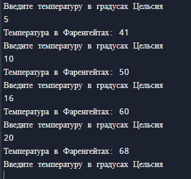
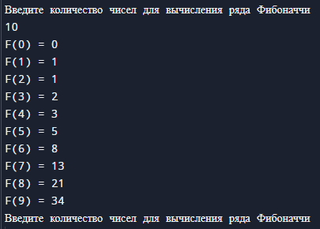
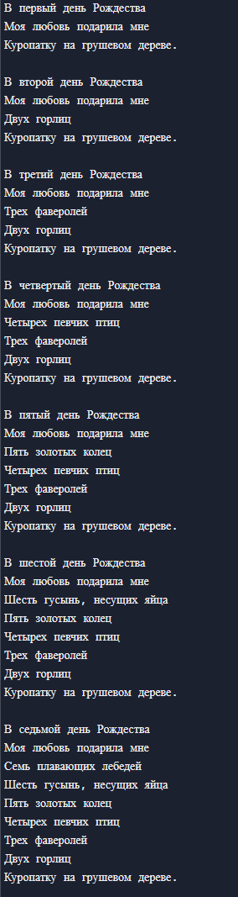

# Task_1

## Задание
1. Конвертация температур между значениями по Фаренгейту к Цельсию.
2. Генерирование n-го числа Фибоначчи.
3. Распечатайте текст рождественской песни "Двенадцать дней Рождества", воспользовавшись повторами в песне.

## Листинг программы 1
```rust

use std::io;

fn main() {
    loop {
        println!("Введите температуру в градусах Цельсия");
        //  Создаем переменную для хранения введенного значения
        let mut temperature = String::new();
        
        //  Обрабатываем пользовательский ввод
        io::stdin()
            .read_line(&mut temperature)
            .expect("Failed to read line");

        // Обработка недопустимого ввода
        let temperature: u32 = match temperature.trim().parse() {
            Ok(num) => num,
            Err(_) => continue,
        };
        // Конвертируем градусы Цельсия в Фаренгейты
        let Farengeith: u32 = temperature*9/5+32;

        //  Выводим результат
        println!("Температура в Фаренгейтах: {Farengeith}");
        }
}
```
## Листинг программы 2
```rust

// Числа Фибоначчи
use std::io;

// Функция для вычисления ряда Фибоначчи
fn fibonachi(n: u32) -> u64 {
    // Первое число
    if n == 0 {
        return 0;
    // Второе число
    } else if n == 1 {
        return 1;
    // Расчет последующих чисел
    } else {
        let mut a = 0;
        let mut b = 1;
        let mut result = 0;
        
        for _ in 2..=n {
            result = a + b;
            a = b;
            b = result;
        }
        return result;
    }
}

fn main() {
    loop {
        //  Создаем переменную для хранения введенного числа Фибоначчи
        println!("Введите количество чисел для вычисления ряда Фибоначчи");
        let mut n = String::new();

        //  Обработка пользовательского ввода
        io::stdin()
            .read_line(&mut n)
            .expect("Failed to read line");

        // Обработка недопустимого ввода    
        let n: u32 = match n.trim().parse() {
            Ok(num) => num,
            Err(_) => continue,};
        // Вывод ряда Фибоначчи      
        for i in 0..n{
            println!("F({}) = {}", i, fibonachi(i));
        }
    }
}
```
## Листинг программы 3
```rust
//  Текст рождественской песни «Двенадцать дней Рождества»
use std::cmp::Ordering;
use std::io;

fn main() {
    //  Создаем список для хранения значений (дня и подарков)
    let days = [
        ("первый","Куропатку на грушевом дереве."),
        ("второй","Двух горлиц"),
        ("третий", "Трех фаверолей"),
        ("четвертый","Четырех певчих птиц"),
        ("пятый", "Пять золотых колец"),
        ("шестой", "Шесть гусынь, несущих яйца"),
        ("седьмой", "Семь плавающих лебедей"),
        ("восьмой", "Восьмерых доярок"),
        ("девятый", "Девять стучащих барабанщиков"),
        ("десятый", "Десять трубящих трубачей"),
        ("одинадцатый", "Одиннадцать танцующих дам"),
        ("двенадцатый", "Двенадцать прыгающих лордов")
    ];
    
    // Цикл for и сопоставление с шаблоном для вывода текста
    for verse_no in 0..days.len() {
        let (day, _,) = days[verse_no];
        // Выводим первые две строки согласно переменной day
        println!("В {day} день Рождества");
        println!("Моя любовь подарила мне");
        for gift_no in (0..verse_no+1).rev() {
            let (_, rest) = days[gift_no];
            match gift_no.cmp(&verse_no) {
                Ordering::Equal => println!("{rest}"),
                Ordering::Less => println!("{rest}"),
                Ordering::Greater => unreachable!(),
            }
        }
        if verse_no != days.len()-1 {
            println!("");
        }
    }
}
```
## Результат работы программы




## Пояснение
Программа 1 позволяет пользователю вводить данные о температуре в Цельсиях, а на выводе получать информацию о введенной температуре в Фаренгейтах.

Программа 2 позволяет рассчитать ряд Фибоначчи. Пользователь вводит количество для вычисления ряда. В результат выводится ряд Фибоначчи.

Программа 3 печатает текст рождественской песни "Двенадцать дней Рождества", воспользовавшись повторами в песне.