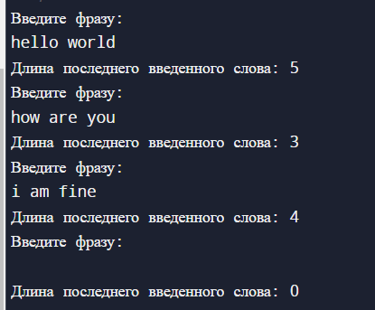
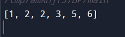
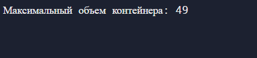
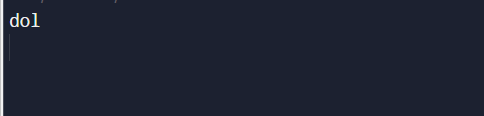

# Task_2

## Задания
1. Дана строка, состоящая из слов и пробелов, возвращает длину последнего слова в строке.
2. Даны два целочисленных массива nums1 и nums2, отсортированные в неубывающем порядке, и два целых числа m и n, представляющие количество элементов в nums1 и nums2 соответственно. Выполнить слияние в единый массив, отсортированный в неубывающем порядке
3. Вам дан целочисленный массив height длины n. Вертикальные линии n нарисованы таким образом, что двумя конечными точками i_th линии являются (i, 0) и (i, height[i]).Найдите две линии, которые вместе с осью x образуют емкость, такую, чтобы в емкости находилось больше всего воды. Верните максимальное количество воды, которое может вместить контейнер.
4. Напишите функцию, чтобы найти самую длинную общую строку префикса среди массива строк. Если общего префикса нет, вернуть пустую строку.

## Листинг программы 1
```rust
// Длина последнего слова в строке
use std::io; 
struct Solution; 

impl Solution {
    pub fn length_of_last_word(s: String) -> usize {
        // Обработка ввода: убираем лишние пробелы и выведем последний введенный элемент    
        let s = match s.trim().split_whitespace().last() { 
            Some(s) => s.len(), 
            None => 0, 
        }; 
        s
    }
}
fn main() { 
    loop {
        // Просим пользователя ввести строку 
        println!("Введите фразу: "); 
        let mut word = String::new(); 
        //  Обработка пользовательского ввода 
        io::stdin().read_line(&mut word) 
                .expect("Failed to read line"); 
        println!("Длина последнего введенного слова: {}", Solution::length_of_last_word(word)); 
    }
}
```
## Листинг программы 2
```rust
// Слияние отсортированного массива
struct Solution;
impl Solution {
    pub fn merge(nums1: &mut Vec<i32>, m: i32, nums2: &mut Vec<i32>, n: i32) {
        // Выполняем усечение массивов согласно их размеру
        nums1.truncate(m as usize);
        nums2.truncate(n as usize);
        // Выполняем слияние
        nums1.append(nums2); 
        // Сортируем массив
        nums1.sort();
    }
}

fn main() { 
    // Вводим первый массив   
    let mut nums1 = vec![1,2,3,0,0,0];
    // Вводим размер первого массива
    let m = 3;
    // Вводим второй массив
    let mut nums2 = vec![2,5,6];
    // Вводим размерность второго массива
    let n = 4;
    // Вызываем функцию для слияния в единый массив
    let sln = Solution::merge(&mut nums1, m, &mut nums2, n); 
    println!("{:?}", nums1);
}
```
## Листинг программы 3
```rust
// Емкость с наибольшим количеством воды
struct Solution;

impl Solution {
    pub fn max_area(height: Vec<i32>) -> i32 {
        let mut max_volume = 0; // Максимальный объем воды
        let mut left_border = 0; // Левая граница
        let mut right_border = height.len() - 1; // Правая граница

        while left_border < right_border {
            // Вычисляем текущий объем воды. Ширина * минимальная высота границ
            let current_volume = (right_border - left_border) as i32 * height[left_border].min(height[right_border]);
            // Вычисляем максимальный объем воды 
            max_volume = max_volume.max(current_volume);

            // Сдвигаем границы в сторону увеличения высоты
            if height[left_border] < height[right_border] {
                left_border += 1;
            } else {
                right_border -= 1;
            }
        }

        max_volume // Возвращаем максимальный объем 
    }
}

fn main() {
    let height = vec![1, 8, 6, 2, 5, 4, 8, 3, 7];
    println!("Максимальный объем контейнера: {}", Solution::max_area(height));
}
```
## Листинг программы 4
```rust
// Самый длинный общий префикс
struct Solution;

impl Solution {
    pub fn longest_common_prefix(strs: Vec<String>) -> String {
        // С помощью итератора получаем минимальную длину из всех строк
        let min_length = strs.iter().map(|s| s.len()).min().unwrap();

        for i in 0..min_length {
            // Получаем байтовое значение символа 
            let chr = strs[0].as_bytes()[i];

            for j in 1..strs.len() {
                if strs[j].as_bytes()[i] != chr {
                    return strs[0][..i].to_string(); // Если буквы не совпадают, возвращаем префикс
                }
            }
        }
        // Если все символы совпадают, то возвращаем клон первого слова
        strs[0].clone()
    }
}
fn main() {
    let strings = vec!["dollar".to_string(), "dolphin".to_string(), "dolby".to_string()]; 
    println!("{}", Solution::longest_common_prefix(strings));
}
```
## Результат работы программы





## Пояснение
Программа 1 позволяет вычислить длину последнего слова в строке.

Программа 2 дает возможность слиять два массива в единый.

Программа 3 позволяет посчитать объем воды, который может вместить контейнер.

Программа 4 ищет самую длинную общую строку префикса в введенной строке.

