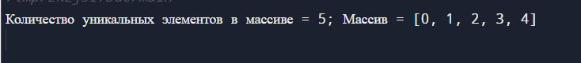
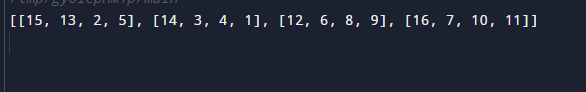
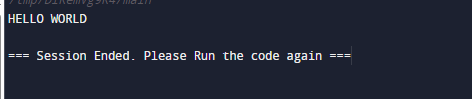

# Task_3

## Задания
1. При наличии целочисленного массива nums, отсортированного в порядке неубывания, удалите дубликаты на месте, чтобы каждый уникальный элемент отображался только один раз. Относительный порядок элементов должен оставаться неизменным. Затем верните количество уникальных элементов в nums. Предположим, что количество уникальных элементов nums равно k, для того, чтобы их приняли, вам нужно выполнить следующие действия:
- Измените массив nums таким образом, чтобы первые k элементов nums содержали уникальные элементы в том порядке, в котором они изначально присутствовали в nums. Остальные элементы nums не важны, так же как и размер nums.
- Верните k.

2. Вам дана n x n двумерных матриц, представляющих изображение, поверните изображение на 90 градусов (по часовой стрелке). Вы должны повернуть изображение на месте, что означает, что вам необходимо изменить входную двумерную матрицу напрямую. НЕ выделяйте другую двумерную матрицу и не выполняйте поворот.
3. Необходимо реализовать функцию, которая принимала бы азбуку Морзе в качестве входных данных и возвращала бы декодированную человекочитаемую строку.
4. Ваша задача - реализовать две функции:
- Функция decodeBits(bits), которая должна определять скорость передачи сообщения, корректно декодировать сообщение в точки ., тире - и пробелы (один между символами, три между словами) и возвращать их в виде строки. 
- Функция decodeMorse(morseCode), которая будет принимать выходные данные предыдущей функции и возвращать удобочитаемую строку.

## Листинг программы 1
```rust
// Удаление дубликатов
struct Solution;

impl Solution {
    pub fn remove_duplicates(nums: &mut Vec<i32>) -> i32 {
        // Переменная для подсчета количества уникальных элементов
        let mut uniq_count = 1;
        // Проходимся по элементам массива и проверяем, совпадает ли текущий элемент с предыдущим 
        for i in 1..nums.len() {
            // Если элементы отличаются, добавляем текущий элемент в массив
            if nums[i] != nums[uniq_count - 1] {
                nums[uniq_count] = nums[i];
                // Прибавляем на 1 количество уникальных элементов
                uniq_count += 1;
            }
        }
        // Производим усечение вектора до количества уникальных элементов
        nums.truncate(uniq_count);
        // Возвращаем количество уникальных элемен
        uniq_count as i32 
    }
}

fn main() {
    // Вводим массив целых чисел
    let mut nums = vec![0, 0, 1, 1, 1, 2, 2, 3, 3, 4];
    let expectedNums = Solution::remove_duplicates(&mut nums);
    // Выводим результат
    println!("Количество уникальных элементов в массиве = {}; Массив = {:?}", expectedNums , nums);
}
```
## Листинг программы 2
```rust
// Поворот изображений
struct Solution;

impl Solution {
    pub fn rotate(matrix: &mut Vec<Vec<i32>>) {
        // Меняем строки местами
        for i in 0..matrix.len() {
            for j in i..matrix.len() {
                let temp = matrix[i][j];
                matrix[i][j] = matrix[j][i];
                matrix[j][i] = temp;
            }
        }
        // Разворачиваем матрицу
        for i in matrix {
            i.reverse();
        }
    }
}

fn main() {
    // Вводим исходную матрицу
    let mut matrix = vec![
    vec![5,1,9,11],
    vec![2,4,8,10],
    vec![13,3,6,7],
    vec![15,14,12,16]];
    // Выводим результат
    Solution::rotate(&mut matrix);
    println!("{:?}", matrix);
}
```

## Листинг программы 3
```rust
// Азбука Морзе 1
use std::collections::HashMap;

fn morse_translated(code: &str) -> String {
    // Добавляем таблицу Азбуки Морзе  
    let mut morse_code: HashMap<String, String> = HashMap::new();
        morse_code.insert(String::from(".-"), String::from("A"));
        morse_code.insert(String::from("-..."), String::from("B"));
        morse_code.insert(String::from("-.-."), String::from("C"));
        morse_code.insert(String::from("-.."), String::from("D"));
        morse_code.insert(String::from("."), String::from("E"));
        morse_code.insert(String::from("..-."), String::from("F"));
        morse_code.insert(String::from("--."), String::from("G"));
        morse_code.insert(String::from("...."), String::from("H"));
        morse_code.insert(String::from(".."), String::from("I"));
        morse_code.insert(String::from(".---"), String::from("J"));
        morse_code.insert(String::from("-.-"), String::from("K"));
        morse_code.insert(String::from(".-.."), String::from("L"));
        morse_code.insert(String::from("--"), String::from("M"));
        morse_code.insert(String::from("-."), String::from("N"));
        morse_code.insert(String::from("---"), String::from("O"));
        morse_code.insert(String::from(".--."), String::from("P"));
        morse_code.insert(String::from("--.-"), String::from("Q"));
        morse_code.insert(String::from(".-."), String::from("R"));
        morse_code.insert(String::from("..."), String::from("S"));
        morse_code.insert(String::from("-"), String::from("T"));
        morse_code.insert(String::from("..-"), String::from("U"));
        morse_code.insert(String::from("...-"), String::from("V"));
        morse_code.insert(String::from(".--"), String::from("W"));
        morse_code.insert(String::from("-..-"), String::from("X"));
        morse_code.insert(String::from("-.--"), String::from("Y"));
        morse_code.insert(String::from("--.."), String::from("Z"));
        morse_code.insert(String::from("-----"), String::from("0"));
        morse_code.insert(String::from(".----"), String::from("1"));
        morse_code.insert(String::from("..---"), String::from("2"));
        morse_code.insert(String::from("...--"), String::from("3"));
        morse_code.insert(String::from("....-"), String::from("4"));
        morse_code.insert(String::from("....."), String::from("5"));
        morse_code.insert(String::from("-...."), String::from("6"));
        morse_code.insert(String::from("--..."), String::from("7"));
        morse_code.insert(String::from("---.."), String::from("8"));
        morse_code.insert(String::from("----."), String::from("9"));
        morse_code.insert(String::from(".-.-.-"), String::from("."));
        morse_code.insert(String::from("--..--"), String::from(","));
        morse_code.insert(String::from("..--.."), String::from("?"));
        morse_code.insert(String::from(".----."), String::from("'"));
        morse_code.insert(String::from("-.-.--"), String::from("!"));
        morse_code.insert(String::from("-..-."), String::from("/"));
        morse_code.insert(String::from("-.--."), String::from("("));
        morse_code.insert(String::from("-.--.-"), String::from(")"));
        morse_code.insert(String::from(".-..."), String::from("&"));
        morse_code.insert(String::from("---..."), String::from(":"));
        morse_code.insert(String::from("-.-.-."), String::from(";"));
        morse_code.insert(String::from("-...-"), String::from("="));
        morse_code.insert(String::from(".-.-."), String::from("+"));
        morse_code.insert(String::from("-....-"), String::from("-"));
        morse_code.insert(String::from("..--.-"), String::from("_"));
        morse_code.insert(String::from(".-..-."), String::from("\""));
        morse_code.insert(String::from("...-..-"), String::from("$"));
        morse_code.insert(String::from(".--.-."), String::from("@"));
        morse_code.insert(String::from("...---..."), String::from("SOS"));
    
    // Инициализируем переменную для итоговой строки
    let mut res_string = String::new();
    // Разбиваем строки на подстроки, удаляем лишние пробелы 
    let words: Vec<&str> = code.trim().split("  ").collect();

    for word in words {
        // Проходимся по каждому слову
        for morse_character in word.split(" ") {
            if morse_character != "" {
                // Декодируем побуквенно слово
                res_string += morse_code.get(morse_character).unwrap();
            }
        }
        // Добавляем пробел между словами
        res_string.push_str(" ");
    }
    res_string
}

fn main() {
    // Пишем строку на Азбуке Морзе
    let morse_words = ".... . .-.. .-.. ---  .-- --- .-. .-.. -..";
    // Вызываем функцию для декодирования
    let decoded_string = morse_translated(morse_words);
    // Выводим результат
    println!("{}", decoded_string);  
}
```

## Результат работы программ




## Пояснение
Программа 1 удаляет дубликаты чисел в массиве и выводит количество уникальных элементов и итоговый массив.

Программа 2 поворачивает изображение матрицы на 90 градусов.

Программа 3 декодирует строку, написанную на Азбуке Морзе в человекочитаемую строку.
