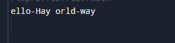
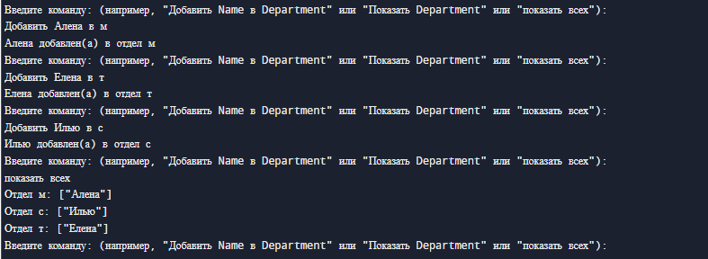

# Task_4

## Задания
1. Учитывая список целых чисел, используйте вектор и верните медиану (при сортировке значение в средней позиции) и режим (значение, которое встречается чаще всего; здесь будет полезна хэш-карта) списка.
2. Преобразование строк в свиную латынь. Первая согласная каждого слова перемещается в конец слова и добавляется «ай», так что «первый» становится «первым-фэй». К словам, начинающимся с гласной, в конце добавляется слово «hay» («apple» становится «apple-hay»). Помните о деталях кодировки UTF-8!
3. Используя хеш-карту и векторы, создайте текстовый интерфейс, позволяющий пользователю добавлять имена сотрудников в отдел компании. Например, «Добавьте Салли в инженерное дело» или «Добавьте Амира в отдел продаж». Затем позвольте пользователю получить список всех людей в отделе или всех людей в компании по отделам, отсортированный в алфавитном порядке.

## Листинг программы 1
```rust
// Вычисление медианы и моды списка
use std::collections::HashMap;

fn MedianAndMode(list: &mut Vec<i32>) -> (f64, i32) {
    // Отсортируем список по возрастанию
    list.sort();
    
    // Если количество элементов четное
    let median: f64 = if list.len() % 2 == 0 {
        let seredina = list.len() / 2;
        (list[seredina-1] + list[seredina]) as f64 / 2.0
    }
    //  Если количество элементов нечетное
    else {
        list[list.len() / 2] as f64
    };
    
    // Создаем хэш-карту
    let mut map = HashMap::new();
    // Добавляем в хэш-карту значения списка
    for i in list.iter() {
        let mode = map.entry(i).or_insert(0);
        *mode += 1;
    }
    let mut mode = 0;
    let mut max_values = 0;
    
    // Ищем моду списка
    for (&i, &count) in &map {
        if count > max_values {
            max_values = count;
            mode = *i;
        }
    }
    (median, mode)
}

fn main() {
    // Вводим список целых чисел
    let mut list = vec![1,2,2,4,7,9,7,3,3,7];
    let (median, mode) = MedianAndMode(&mut list);
    // Выводим результат
    println!("Median {}", median);
    println!("Mode {}", mode);
}
```
## Листинг программы 2
```rust
// Свиная латынь

// Функция для обработки конкретного слова
fn pig_translate(word: &str) -> String {
    // Объявляем список с гласными буквами
    let glas = ['a', 'i', 'e', 'o', 'y'];
    //  Получаем первую букву слова
    let mut first_chat = word.chars().take(1).last().unwrap();
    
    // Если слово начинается с гласной
    if glas.contains(&mut first_chat) {
        // Добавляем -hay в конец слова
        return format!("{}-hay", word);
        }
    // Если слово начинается с согласной
    else {
        let mut chars = word.chars();
        // Получаем первую букву слова
        let first_soglas = chars.next().unwrap();
        // Усекаем первую букву из слова
        let rest_of_word: String = chars.collect();
        return format!("{}-{}ay", rest_of_word, first_soglas);
        }
}

// Построение предложений из переведенных слов
fn get_translated_words(words: &str) -> String {
    let mut translated_words = String::new();
    // Разделяем полученную строку на слова
    for word in words.split_whitespace() {
        // Вызываем функцию для перевода каждого слова
        let translated_pig_word = pig_translate(word);
        // Добавляем переведенное слово в строку
        translated_words.push_str(&translated_pig_word);
        // Разделяем слова пробелами
        translated_words.push(' ');
    }
    translated_words.to_string()
}

fn main() {
    // Вводим строку
    let word = "Hello world";
    // Вызываем функцию
    let translate = get_translated_words(word);
    // Выводим результат
    println!("{}", translate);
}
```
## Листинг программы 3
```rust
use std::collections::HashMap; 
use std::io;

fn main() { 
    // Создаем пустую хэш-карту для хранения сотрудников по отделам
    let mut company: HashMap<String, Vec<String>> = HashMap::new(); 
    loop { 
        // Бесконечный цикл для обработки пользовательских команд
        println!("Введите команду: (например, \"Добавить Name в Department\" или \"Показать Department\" или \"показать всех\"):");
        // Создаем пустую строку для ввода пользователя
        let mut input = String::new(); 
        // Читаем строку из стандартного ввода
        io::stdin().read_line(&mut input).expect("Не удалось прочитать строку");
        // Удаляем начальные и конечные пробелы из введенной строки
        let input = input.trim(); 

        if input.starts_with("Добавить ") { 
            add_employee(&mut company, input); /
        } else if input.starts_with("Показать ") { /
            show_department(&company, input); 
        } else if input.to_lowercase() == "показать всех" { 
            show_all(&company); 
        }
    }
}

fn add_employee(company: &mut HashMap<String, Vec<String>>, input: &str) {
    // Разбиваем введенную строку на части по пробелам и сохраняем в вектор
    let parts: Vec<&str> = input.split_whitespace().collect(); 
    // Проверяем, что команда содержит достаточно частей (Добавить, Имя, в, Отдел)
    if parts.len() < 4 { 
        println!("Неверный формат команды. Попробуйте снова."); 
        return; 
    }
    // Получаем имя сотрудника из команды
    let name = parts[1]; 
    // Получаем название отдела из команды
    let department = parts[3]; 
    // Получаем или создаем вектор сотрудников для отдела
    let employees = company.entry(department.to_string()).or_insert(Vec::new()); 
    // Добавляем имя сотрудника в вектор
    employees.push(name.to_string()); 

    println!("{} добавлен(а) в отдел {}", name, department); 
}

fn show_department(company: &HashMap<String, Vec<String>>, input: &str) {
    // Разбиваем введенную строку на части по пробелам и сохраняем в вектор
    let parts: Vec<&str> = input.split_whitespace().collect(); 
    // Проверяем, что команда содержит достаточно частей (Показать, Отдел)
    if parts.len() < 2 { 
        println!("Неверный формат команды. Попробуйте снова"); 
        return; 
    }
    // Получаем название отдела из команды
    let department = parts[1]; 
     // Пытаемся получить вектор сотрудников для отдела
    match company.get(department) {
        Some(employees) => {
             // Клонируем вектор сотрудников для сортировки
            let mut sorted_employees = employees.clone();
            sorted_employees.sort(); 
            println!("Сотрудники отдела {}: {:?}", department, sorted_employees); 
        },
        None => println!("Отдел {} не найден", department),
    }
}

fn show_all(company: &HashMap<String, Vec<String>>) {
    // Получаем список всех отделов и сохраняем в вектор
    let mut departments: Vec<&String> = company.keys().collect(); 
    departments.sort(); 
     // Проходим по всем отделам
    for department in departments {
        // Клонируем вектор сотрудников для отдела
        let mut employees = company.get(department).unwrap().clone(); 
        employees.sort(); 
        // Выводим отсортированный список сотрудников отдела
        println!("Отдел {}: {:?}", department, employees); 
    }
}
```


## Результат работы программ




## Пояснение
Программа 1 вычисляет медиану и моду списка целых чисел.

Программа 2 переводит фразу на свиную латынь. 

Программа 3 создает текстовый интерфейс добавления сотрудников.